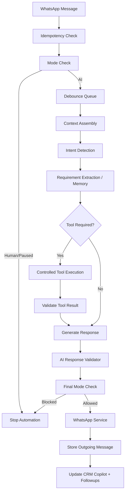

# AI Conversation Brain

## Overview
The Advanced AI Conversation Brain transforms the Karjat Properties AI into a highly context-aware, robust orchestration layer. It manages real-time debouncing, multi-intent detection, and strict safety validation while keeping responses conversational and natural.

## Architecture & Flow

## Core Systems

### 1. Idempotency & Debounce (Queue)
**Problem:** Rapid messages (e.g., "Hi", "3 bhk", "price?") can cause parallel AI processing, leading to triple responses.
**Solution:**
- Idempotency via `whatsapp_message_id` lookup in `messageRepository`.
- `conversationQueueService.ts` implements an in-memory 3000ms debounce. If a customer sends multiple messages rapidly, the timer resets. The orchestrator triggers only once they finish typing, sending the combined buffer as unified context.

### 2. Context Assembly
`conversationContextService.ts` manages token windows by fetching:
- The last 20 messages.
- The `lead_requirements` (Memory).
- Recent property interactions (Shortlisted, Visited).
- Lead stage.

### 3. Intent Detection
`intentDetectionService.ts` evaluates the buffer (T=0.1) and maps natural language to explicit CRM intents like `PROPERTY_SEARCH`, `SITE_VISIT_REQUEST`, `NEGOTIATION`.
- **Multi-Intent Support:** Can return `["PROPERTY_PRICE", "SITE_VISIT_REQUEST"]`.
- **Confidence Rating:** Aborts or escalates to human if confidence is too low.

### 4. Response Validation (Safety)
`aiResponseValidator.ts` ensures:
- **No ID Leaks:** Redacts any raw UUIDs accidentally leaked by the AI.
- **No JSON/CoT Leaks:** Blocks responses containing markdown JSON blocks or system prompts.
- **No False Promises:** Screens for words like "100% guaranteed" or "legal advice".

### 5. Double Mode-Check (Race Conditions)
1. **Initial Check:** Rejects webhook if mode is HUMAN/PAUSED.
2. **Final Check:** Just before dispatching the AI text to Meta API, the system queries the DB `conversation.mode` one last time. If an agent took over *during* the 3-5 seconds the AI was generating, the message is silently aborted.

## Tools
The AI uses registered tools natively integrated with the backend:
- `searchProperties`
- `sendPropertyToCustomer`
- `requestHumanAgent`
- `createSiteVisitRequest`
- `cancelSiteVisit`

No SQL parsing or unverified DB access is permitted.
