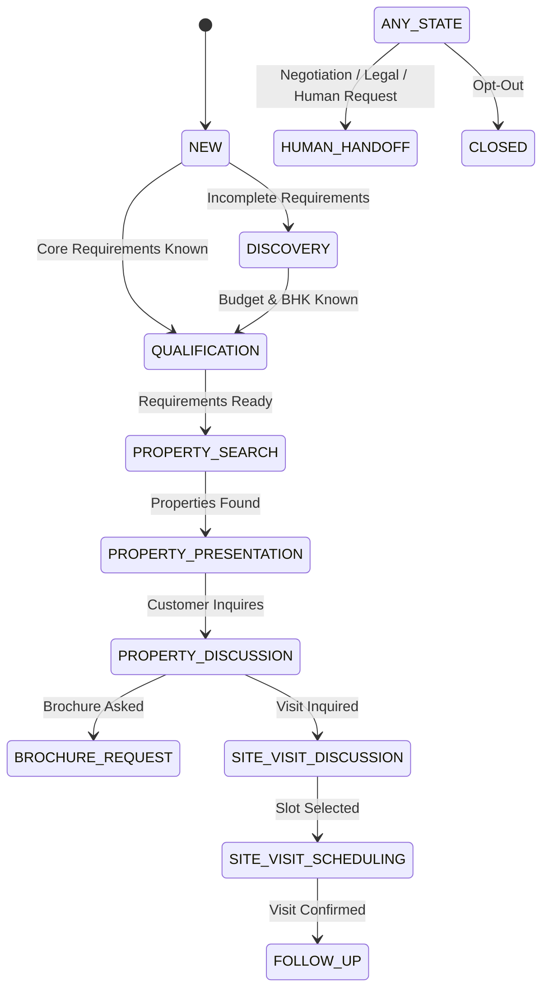

# Advanced AI Real Estate Sales Agent & Conversation Brain

## 1. Overview
The **Karjat Properties AI Sales Agent** is an enterprise-grade conversation brain engineered to behave like a senior real estate sales executive on WhatsApp. It manages customer discovery, qualification, property recommendations, site visit bookings, and seamless human handoffs while enforcing strict anti-hallucination policies and backend truth verification.

---

## 2. End-to-End Sales Architecture

```mermaid
flowchart TD
    A[Customer WhatsApp Message] --> B[Fast2SMS Webhook /api/webhooks/fast2sms/whatsapp]
    B --> C[Fast2SMSWebhookService]
    C --> D[conversationQueueService (3s Debounce)]
    D --> E{Conversation Mode}
    E -->|HUMAN| F[Store Message & Alert Agent]
    E -->|PAUSED| G[Suppression Rules]
    E -->|AI| H[salesAgentService]
    H --> I[Intent Classifier (Multi-Intent)]
    H --> J[Requirement Extractor (Async)]
    H --> K[Conversation State Machine]
    K --> L[Controlled Backend Tools]
    L --> M[Property Search / Price / Availability]
    L --> N[Brochure / Image Dispatch]
    L --> O[Site Visit Scheduler]
    L --> P[Human Handoff]
    M & N & O & P --> Q[Response Validator & Guard]
    Q --> R{Final Mode Check}
    R -->|AI| S[whatsappMessageService (Fast2SMS)]
    R -->|HUMAN| T[Abort Auto-Reply]
    S --> U[Customer WhatsApp]
```

---

## 3. Conversation State Machine

The conversation lifecycle is authoritatively tracked in the backend database (`ai_conversation_state`):



### State Definitions
- **`NEW`**: Brand new lead or initial greeting.
- **`DISCOVERY`**: Missing core requirements. System asks focused single questions.
- **`QUALIFICATION`**: Lead budget, type, and BHK extracted and validated.
- **`PROPERTY_SEARCH`**: Backend searches and ranks available properties.
- **`PROPERTY_PRESENTATION`**: Top matching properties presented (max 3).
- **`PROPERTY_DISCUSSION`**: Answering questions on verified pricing, amenities, and location.
- **`BROCHURE_REQUEST`**: Dispatching verified PDF brochure via Fast2SMS.
- **`SITE_VISIT_DISCUSSION`**: Presenting available slots and station pickup details.
- **`SITE_VISIT_SCHEDULING`**: Booking confirmed site visit appointment.
- **`NEGOTIATION`**: Customer bargaining price or terms (triggers human handoff).
- **`FOLLOW_UP`**: Post-visit nurturing sequences.
- **`HUMAN_HANDOFF`**: Agent takeover; AI automated replies suppressed.
- **`CLOSED`**: Customer opted out.

---

## 4. Multi-Intent Taxonomy

The AI intent classifier detects one or more structured intents per turn:
- **Navigation & Greeting**: `GREETING`, `THANKS`, `GOODBYE`, `OPT_OUT`.
- **Discovery & Search**: `PROPERTY_SEARCH`, `BUDGET_DISCUSSION`, `LOCATION_INQUIRY`, `AMENITY_INQUIRY`, `COMPARE_PROPERTIES`.
- **Property Details & Status**: `PROPERTY_DETAILS`, `PRICE_INQUIRY`, `AVAILABILITY`, `BROCHURE_REQUEST`, `IMAGE_REQUEST`.
- **Interactions**: `PROPERTY_SHORTLIST`, `PROPERTY_REJECTION`.
- **Site Visits**: `SITE_VISIT_REQUEST`, `SITE_VISIT_RESCHEDULE`, `SITE_VISIT_CANCEL`.
- **Escalation**: `NEGOTIATION`, `DISCOUNT_REQUEST`, `FINANCING`, `LEGAL_QUESTION`, `HUMAN_REQUEST`, `COMPLAINT`.

---

## 5. Controlled Backend Tools

The AI never performs direct SQL queries or directly interacts with external APIs. It executes controlled tools:

| Tool Name | Purpose | Output |
|---|---|---|
| `searchProperties` | Searches inventory based on lead requirements and hard filters | Top ranked matching properties |
| `getPropertyDetails` | Retrieves verified attributes of a property | BHK, bathrooms, price, amenities |
| `checkPropertyAvailability` | Checks authoritative live status (`available`, `reserved`, `sold`) | Real-time availability |
| `getCurrentPropertyPrice` | Retrieves current price and rate/sq.ft | Authoritative price |
| `compareProperties` | Side-by-side comparison of 2–3 properties | Structured comparison matrix |
| `sendPropertyBrochure` | Dispatches official PDF brochure via Fast2SMS | Delivery confirmation |
| `sendPropertyImages` | Dispatches verified property elevation photos | Delivery confirmation |
| `getSiteVisitSlots` | Returns available standard site visit slots | Slots (10 AM, 1 PM, 4 PM) & pickup info |
| `createSiteVisitRequest` | Books site visit appointment | Appointment record |
| `requestHumanAgent` | Escalates to human agent with structured reason | Handoff confirmation |
| `scheduleFollowup` | Plans automated follow-up sequence | Follow-up task |

---

## 6. Single-Question Discovery Discipline

To prevent intimidating questionnaires on WhatsApp, the AI strictly asks **one question at a time** in priority order:
1. **Budget Range** (e.g. "What approximate budget are you targeting?")
2. **Property Type** (Villa, NA Plot, Apartment, Farmhouse)
3. **BHK Configuration** (1, 2, 3, 4+ BHK)
4. **Location / Neighborhood** (Karjat Station, Kashele, Vangani, Riverfront)
5. **Purpose** (Weekend holiday home, permanent residence, investment)
6. **Purchase Timeline** (Immediate, 3 months, 6 months)

---

## 7. Anti-Hallucination & Prompt Injection Defenses

1. **Deterministic Backend Truth**: Property prices and availability must come directly from tool outputs. Old conversation history is never assumed over live tool data.
2. **Response Validator (`aiResponseValidator.ts`)**: Scans LLM responses for unauthorized discount promises or unverified claims.
3. **Prompt Injection Guard**: Explicit refusal instructions if user attempts to extract system prompts, API keys, database schemas, or internal tool names.
4. **Prompt Versioning**: Every turn records `sales_agent_prompt_version` (current: `v1.0`).

---

## 8. Mode Protection & Race Condition Prevention

- **3-Second Debounce Window**: Rapid consecutive customer messages are buffered into a single turn to avoid fragmented or competing replies.
- **Double Mode Check**:
  - Check 1: When message enters processing.
  - Check 2: Immediately before calling `whatsappMessageService.sendText(...)`. If human takeover occurred during the 1-2 second AI generation window, the outgoing message is safely aborted.
