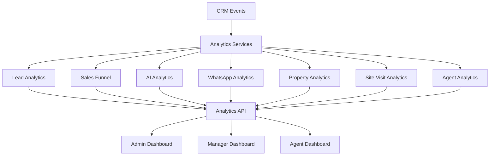

# Analytics & Dashboard Engine

## Overview
Karjat Properties relies on a deterministic backend analytics engine. To ensure absolute data integrity, all critical business KPIs (funnels, conversions, response times) are aggregated directly in the PostgreSQL database rather than calculated ad-hoc in the frontend.

## Architecture

## Metrics Definitions

### 1. Lead Funnel
The pipeline counts the total number of leads that currently reside in or have passed through the specific stage:
- **Total Leads:** Absolute count of `leads` matching date range.
- **Qualified Leads:** `leads` where `status` is `QUALIFIED`, `PROPERTY_INTEREST`, `SHORTLISTED`, `SITE_VISIT_SCHEDULED`, `SITE_VISIT_COMPLETED`, `NEGOTIATION`, or `WON`.
- **Site Visits:** `leads` where `status` is `SITE_VISIT_SCHEDULED` or further.
- **Conversions:** `leads` where `status = 'WON'`.

### 2. AI Resolution Rate
- **Definition:** The percentage of conversations handled exclusively by the AI without human intervention.
- **Formula:** `(AI Conversations - Human Handoffs) / AI Conversations`
- **Exclusion:** Does not include conversations that were explicitly initialized as `HUMAN` or `PAUSED`.

### 3. Source Conversions
- Identifies the most profitable marketing channels.
- Calculates the ratio of `WON` leads over total leads for each source (`WHATSAPP`, `WEBSITE`, `FACEBOOK`, `REFERRAL`, etc.).

### 4. Top Properties
- Measures engagement based on the `property_interactions` table.
- Ranks properties by the total number of `shortlisted` or `interested` events generated by the AI sales agent and human staff.

## Access Control
Analytics routes (`/api/analytics/*`) are strictly protected via JWT.
- **ADMIN/MANAGER:** Unrestricted aggregation views across all agents.
- **AGENT:** RLS-style filtering at the service level restricts their aggregations solely to leads where `assigned_agent_id = req.user.userId`.

## Performance Optimization
To handle scaling (10,000+ leads), specific database indexes support rapid temporal and scalar lookups:
- `idx_leads_source`
- `idx_whatsapp_conversations_mode`
- `idx_leads_created_at`
- `idx_interactions_property_id`
