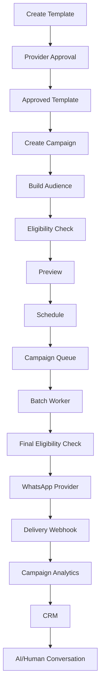

# WhatsApp Campaign Engine

## Overview
Karjat Properties leverages an enterprise-grade broadcast campaign engine capable of dispatching personalized messages at scale while enforcing strict constraints for opt-outs, business hours, and template safety.

## Architecture & Workflow

## System Components

### 1. Template Synchronization
Templates are synchronized directly from the WhatsApp Provider. 
- Templates contain dynamically verifiable `{{variables}}`.
- An explicit allowlist blocks malicious or unsupported variables (e.g. `{{customer_name}}`, `{{property_name}}`).

### 2. Audience Segmentation & Dynamic Builder
Audiences are built by evaluating `JSONB` filter definitions against the `leads` table in real-time. 
To prevent stale audience issues (e.g. scheduling a broadcast 3 days in advance and a customer opting out on day 2), the actual contact IDs are marked as `QUEUED`, but a **Final Eligibility Check** runs milliseconds before the actual WhatsApp dispatch.

### 3. Global Suppression & Opt-outs
`isMarketingEligible(lead)` acts as the ultimate gatekeeper.
- Validates that the lead is not `LOST` or explicitly opted out.
- Implements **Recent Contact Protection**: Prevents a customer from receiving multiple marketing broadcasts within a 24-hour window.

### 4. Background Batch Worker
`campaignWorker.ts` runs asynchronously to process the `campaign_recipients` ledger.
- **Batching**: Pulls in chunks of 50 to prevent memory and network bottlenecks.
- **Sending Windows**: Dispatches are strictly paused outside of business hours (09:00 - 21:00 `Asia/Kolkata`).
- **Idempotency**: Utilizes `provider_message_id` and unique tuples `(campaign_id, lead_id)` to absolutely ensure no customer is spammed twice.

### 5. Webhooks & Analytics
`incomingMessageProcessor.ts` and `whatsappWebhookService.ts` map Meta's delivery receipts (Sent, Delivered, Read, Failed) directly to the granular `campaign_recipients` ledger.

### 6. Conversion Attribution
If a customer replies to a WhatsApp thread within 7 days of receiving a campaign broadcast, the engine automatically flags the `campaign_recipients` ledger with a `replied_at` timestamp and increments the campaign's `replied_count`, allowing the Admin dashboard to accurately attribute conversions and engagement to specific marketing efforts.
