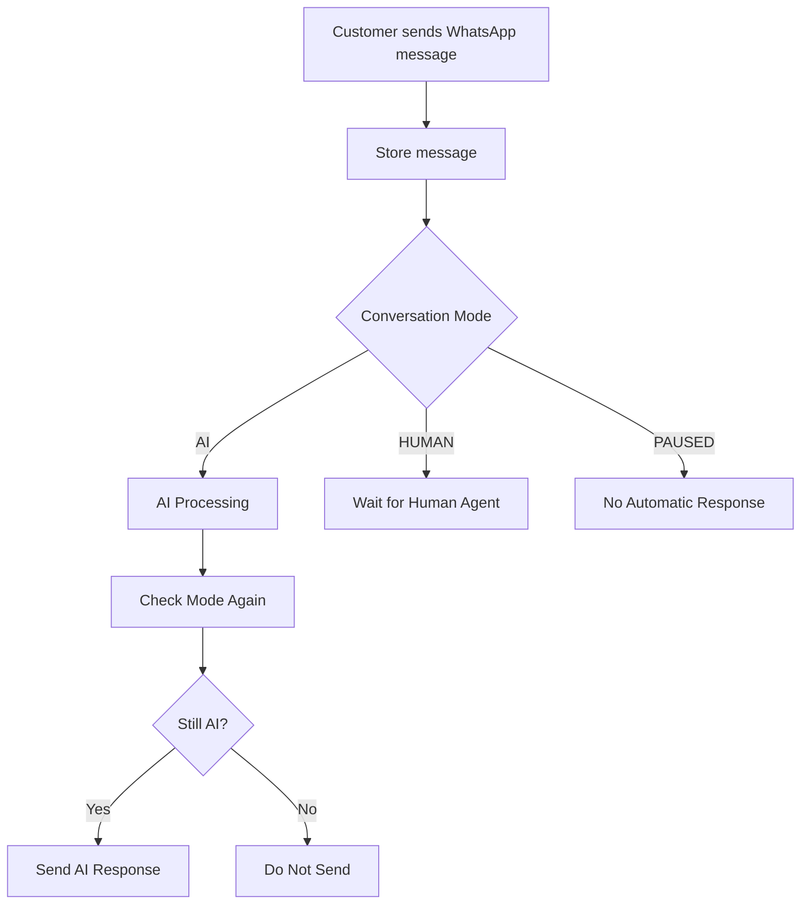

# WhatsApp Conversation Modes

The backend architecture explicitly segregates WhatsApp conversations into three mutually exclusive modes. This governs how the system handles automated AI responses versus human agency.

## Modes

1. **`ai` (Default)**
   - AI processing is fully active.
   - Any incoming customer message triggers the AI response pipeline.
   - Human agents can passively monitor and still send manual messages without breaking the mode, but automated responses will fire alongside them.

2. **`human`**
   - AI responses are completely disabled.
   - Used when a sales agent takes over a conversation to speak to the lead directly.
   - Incoming messages are still logged and stored in the database, but no AI automated processing is triggered.
   - Records `human_takeover_by` and `human_takeover_at`.

3. **`paused`**
   - Both AI responses and automated follow-ups are suspended.
   - Used for snooze states, holidays, or when waiting for a specific event.
   - Incoming messages are still logged.

## Race Condition Prevention (AI Guard)

Because a customer might message while an agent is simultaneously taking over the chat, there is a risk of a race condition resulting in an unwanted AI response.

**Rule:** The future AI pipeline MUST check the conversation mode *immediately* before sending an outbound AI message using the `shouldAIRespond(conversationId)` guard.

## Endpoints

| Endpoint | Method | Purpose |
|----------|--------|---------|
| `/api/conversations/:id/mode` | `GET` | Get current mode |
| `/api/conversations/:id/mode` | `PATCH` | Manually patch mode (`ai`, `human`, `paused`) |
| `/api/conversations/:id/takeover` | `POST` | Agent takes over (switches to `human`, tracks agent) |
| `/api/conversations/:id/release-to-ai`| `POST` | Releases conversation back to `ai` |
| `/api/conversations/:id/pause` | `POST` | Suspend automated processing (`paused`) |

## Future CRM Integration

When a CRM frontend is built, the mode acts as the core toggle on the UI:

- When in AI mode: Show `[ Switch to Human ]` button.
- When in Human mode: Show `[ Switch to AI ]` button.
- When Paused: Show `[ Resume AI ]` button.

Incoming messages must ALWAYS be stored to the database so that conversation history is preserved identically regardless of mode.
