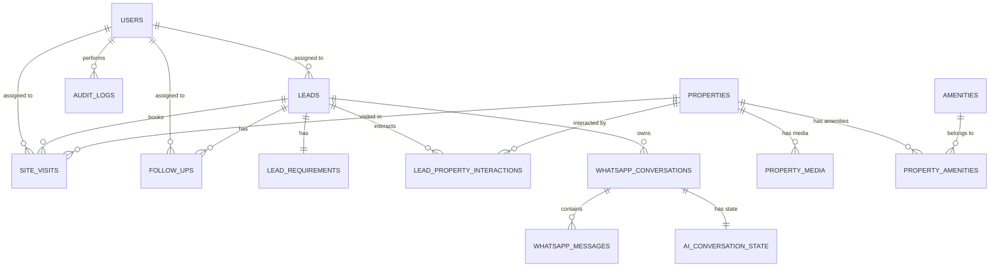

# Database Architecture

This document describes the relational database schema for Karjat Properties, built on PostgreSQL (Supabase).

## ER Diagram

## Tables Overview

1. **`users`**: Admin users and staff members (agents, managers). Used for assigning leads and tracking activity.
2. **`properties`**: Core property information including location, price, type, and availability status.
3. **`property_media`**: Images, videos, and brochures for properties.
4. **`amenities`**: Master list of available amenities (e.g., Pool, Garden).
5. **`property_amenities`**: Many-to-many relationship linking properties to amenities.
6. **`leads`**: Potential customers captured from various sources (WhatsApp, ads).
7. **`lead_requirements`**: Detailed preferences for a lead (budget, BHK, timeline).
8. **`lead_property_interactions`**: Tracks which properties a lead viewed, requested site visits for, etc.
9. **`whatsapp_conversations`**: Tracks active or closed WhatsApp chat sessions.
10. **`whatsapp_messages`**: Individual messages (incoming/outgoing) linked to a conversation.
11. **`ai_conversation_state`**: Stores structured state (JSONB) for the AI agent to remember context.
12. **`site_visits`**: Scheduled and completed property visits by leads.
13. **`follow_ups`**: Scheduled tasks for agents to follow up with leads.
14. **`audit_logs`**: System activity tracking (who did what and when).

## Key Design Principles
- **UUIDs**: All primary keys are UUIDs.
- **Timestamps**: Uses `TIMESTAMPTZ` for timezones. A trigger automatically updates `updated_at`.
- **Soft Constraints**: Enums are implemented using `CHECK` constraints (e.g., `status IN ('available', 'sold')`).
- **Data Integrity**: `ON DELETE CASCADE` is used carefully (e.g., deleting a property deletes its media) while `ON DELETE SET NULL` is used for user assignments to retain historical records if an agent is removed.

## Running Migrations
To apply the schema to a Supabase project:
1. Log in to your Supabase project dashboard.
2. Go to the SQL Editor.
3. Copy the contents of `database/migrations/001_initial_schema.sql` and run it.

## Running Development Seed
To insert dummy data for testing:
1. Copy the contents of `database/seed/001_development_seed.sql`.
2. Run it in the Supabase SQL Editor.
*(Note: Do not run seed data in the production environment).*

## Security Considerations (RLS)
Row Level Security (RLS) is **enabled** on all tables. 
- By default, all direct client access is blocked, making the database secure.
- The Node.js backend connects using the **Supabase Service Role Key** (`SUPABASE_SERVICE_ROLE_KEY`), which inherently bypasses RLS policies.
- **Do not expose the Service Role Key to the frontend.**
- When client-side authentication is implemented in the future, explicit RLS policies (e.g., `CREATE POLICY ...`) will need to be written to grant scoped access to authenticated users.
