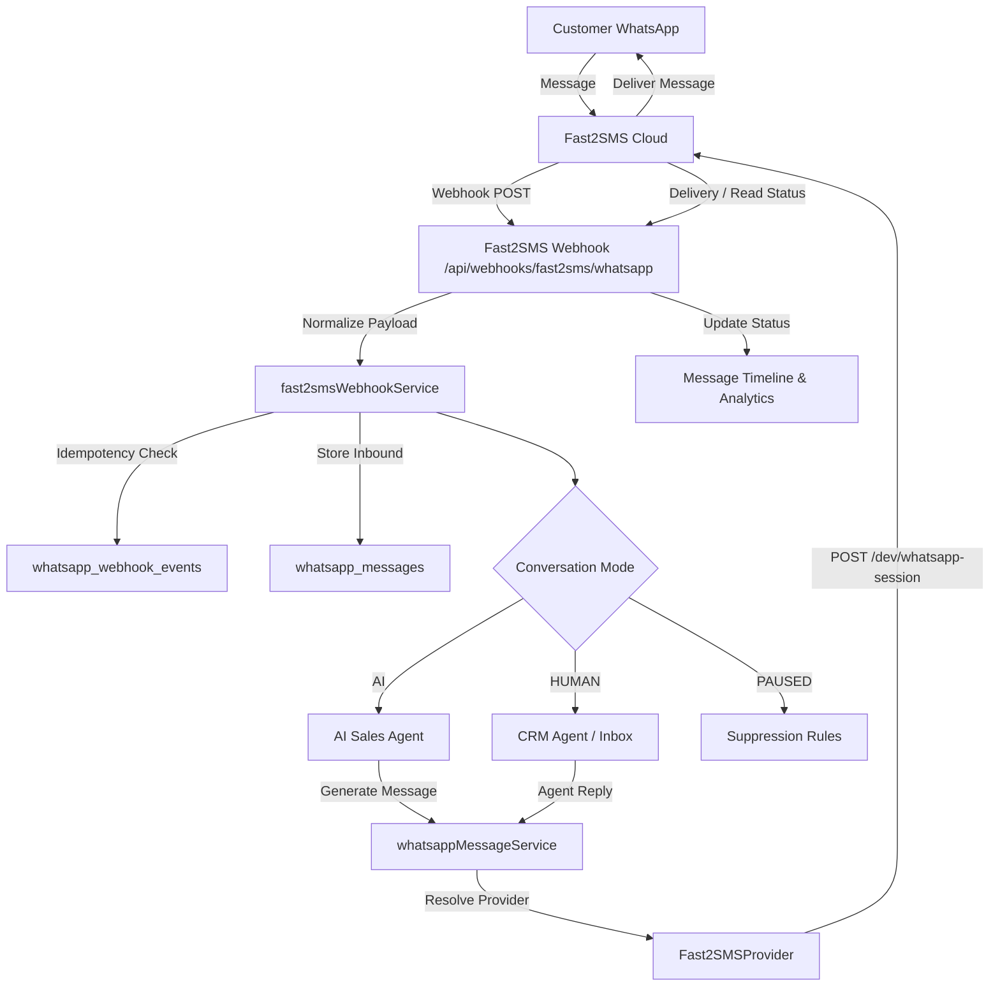

# Fast2SMS WhatsApp Business API Integration

## 1. Overview
Karjat Properties uses the official **Fast2SMS WhatsApp API** as the primary WhatsApp transport provider for AI customer conversations, property recommendations, site visit bookings, lead nurturing, and CRM agent messaging.

---

## 2. Architecture & Message Flow



---

## 3. Fast2SMS Dashboard Setup & Webhook Configuration

### A. Credentials
1. Log into your **Fast2SMS Dashboard**: [https://www.fast2sms.com](https://www.fast2sms.com)
2. Navigate to **Dev API / WhatsApp API**.
3. Retrieve your **API Key** and **Phone Number ID**.

### B. Configure Webhook
1. In the Fast2SMS Dashboard, go to **WhatsApp Webhook Settings**.
2. **Service**: WhatsApp
3. **Webhook URL**: `https://YOUR_BACKEND_DOMAIN/api/webhooks/fast2sms/whatsapp`
4. **HTTP Method**: `POST`
5. **Payload Format**: `JSON`
6. **Active Events**:
   - `Incoming Messages`
   - `On Sent`
   - `On Delivered`
   - `On Read`
   - `On Failed`

---

## 4. Environment Variables

Configure the following variables in your `.env` file:

```env
# WhatsApp Transport Provider (fast2sms | mock)
WHATSAPP_PROVIDER=fast2sms

# Fast2SMS Credentials
FAST2SMS_API_KEY=your_fast2sms_api_key_here
FAST2SMS_PHONE_NUMBER_ID=your_fast2sms_phone_number_id_here
FAST2SMS_API_VERSION=v26.0
FAST2SMS_BASE_URL=https://www.fast2sms.com

# Optional Webhook Security Secret
FAST2SMS_WEBHOOK_SECRET=your_optional_webhook_secret_token
```

> [!CAUTION]
> Never commit `FAST2SMS_API_KEY` to source control or expose it to the browser/frontend.

---

## 5. Session Message API vs Template Messages

### Session Message API (Within 24-Hour Customer Window)
For customer replies and ongoing inquiries inside active conversations, Fast2SMS **Session API** is used:

- **Endpoint**: `POST https://www.fast2sms.com/dev/whatsapp-session?phone_number_id=PHONE_NUMBER_ID&to=919876543210`
- **Headers**:
  ```http
  Authorization: YOUR_FAST2SMS_API_KEY
  Content-Type: application/json
  ```
- **Supported Payloads**:
  - **Text**: `{"type": "text", "text": "Hello! How can I help you?"}`
  - **Image**: `{"type": "image", "image": {"link": "https://...", "caption": "Villa View"}}`
  - **Document / Brochure**: `{"type": "document", "document": {"link": "https://...", "caption": "Brochure", "filename": "Green_Valley.pdf"}}`
  - **Location**: `{"type": "location", "location": {"latitude": 18.9102, "longitude": 73.3283, "name": "Site Office", "address": "Karjat"}}`

### Template Message API (Outside 24-Hour Window & Campaigns)
For re-engaging cold leads or broadcasts outside the customer conversation window:
- **Endpoint**: `POST https://www.fast2sms.com/dev/whatsapp-template?phone_number_id=PHONE_NUMBER_ID&to=919876543210`
- **Payload**: Approved WhatsApp template name, language code, and parameters.

---

## 6. Webhook Idempotency & Delivery Tracking

- Every incoming message and status event is checked against `whatsapp_webhook_events` using `(provider, event_id, event_type)`.
- Duplicate webhooks from network retries are acknowledged with `200 OK` but discarded to prevent double processing or duplicate AI replies.
- Status transitions (`SENT` → `DELIVERED` → `READ` → `FAILED`) are reflected in real time on the CRM message timeline and campaign recipient analytics.

---

## 7. Conversation Modes

1. **AI Mode**:
   - Customer message triggers the AI conversation brain (`conversationOrchestrator`).
   - Verifies properties, checks site visit slots, and sends responses via Fast2SMS.
2. **HUMAN Mode**:
   - Inbound message is stored and assigned agent is notified.
   - Automatic AI replies are strictly suppressed.
   - Agent can reply directly from the CRM using `whatsappMessageService`.
3. **PAUSED Mode**:
   - Message is saved, but automated interactions are temporarily held according to policy.

---

## 8. Provider Health & Diagnostics

Authorized Admins and Managers can inspect provider health:
- `GET /api/whatsapp/health` — Provider name, configured status, reachability, masked phone number ID.
- `GET /api/whatsapp/settings` — Safe configuration metadata.
- `POST /api/whatsapp/test-message` — Dispatch an integration test message.

---

## 9. Error Normalization & Retries

| Error Condition | HTTP Code | Internal Error Class | Handling |
|---|---|---|---|
| Invalid API Key | 401 / 403 | `WhatsAppAuthenticationError` | Alert admins, do not retry |
| Invalid Phone / Payload | 400 / 422 | `WhatsAppValidationError` | Log validation error, mark message failed |
| Fast2SMS Rate Limit | 429 | `WhatsAppRateLimitError` | Exponential backoff retry |
| Server Outage / Timeout | 500 / 503 | `WhatsAppTemporaryError` | Queue retry up to 3 times |
