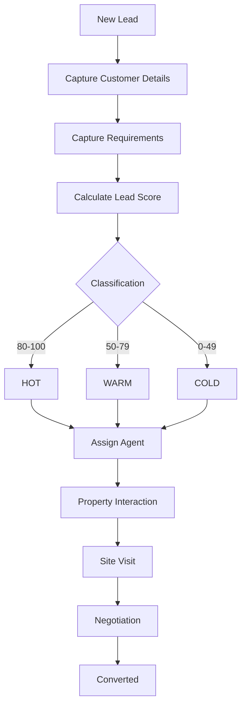

# Lead Management Architecture

## Lead Lifecycle

## Lead Scoring Rules
The lead scoring engine is deterministic, explainable, and recalculates whenever a lead's requirements or property interactions change. It ranges from `0` to `100`.

- **Budget confirmed**: +20
- **Preferred location confirmed**: +10
- **Property type confirmed**: +10
- **BHK confirmed**: +10
- **Purpose confirmed**: +5
- **Purchase timeline**: 
  - Immediate: +25
  - Within 1 month: +20
  - Within 3 months: +15
  - Within 6 months: +10
  - Exploring: +3
- **Interactions**:
  - Site visit requested/completed: +25
  - Property shortlisted: +15
  - Brochure requested: +5
  - Multiple interactions: +5

### Classification
Derived dynamically from the score:
- **HOT**: 80-100
- **WARM**: 50-79
- **COLD**: 0-49

## Phone Normalization & Duplicate Prevention
To prevent duplicating leads if they message from WhatsApp or submit a web form:
- The system normalizes Indian phone numbers (e.g. `9876543210`, `09876543210`, `919876543210`) into a canonical `+91XXXXXXXXXX` format.
- If a lead already exists with the normalized phone, `POST /api/leads` updates their source and returns `200 OK` rather than throwing a duplicate violation.

## Ownership and Authorization
- **Admin & Manager**: Can list, view, and assign any lead.
- **Agent**: Can ONLY view and modify leads where `assigned_agent_id` equals their own `userId`.

## Future AI & WhatsApp Integration
The lead service exposes programmatic interfaces (`createLead`, `updateRequirements`, `addPropertyInteraction`) tailored for a webhook. When a customer messages the future WhatsApp Bot:
1. The webhook extracts their number and calls `createLead()`.
2. The AI parses intent (e.g., "I'm looking for a 3BHK villa under 2cr") and calls `updateRequirements()`.
3. The system automatically recalculates the lead score. If the score becomes HOT (≥80), an audit event `LEAD_BECAME_HOT` is logged, which will trigger future agent notifications.
